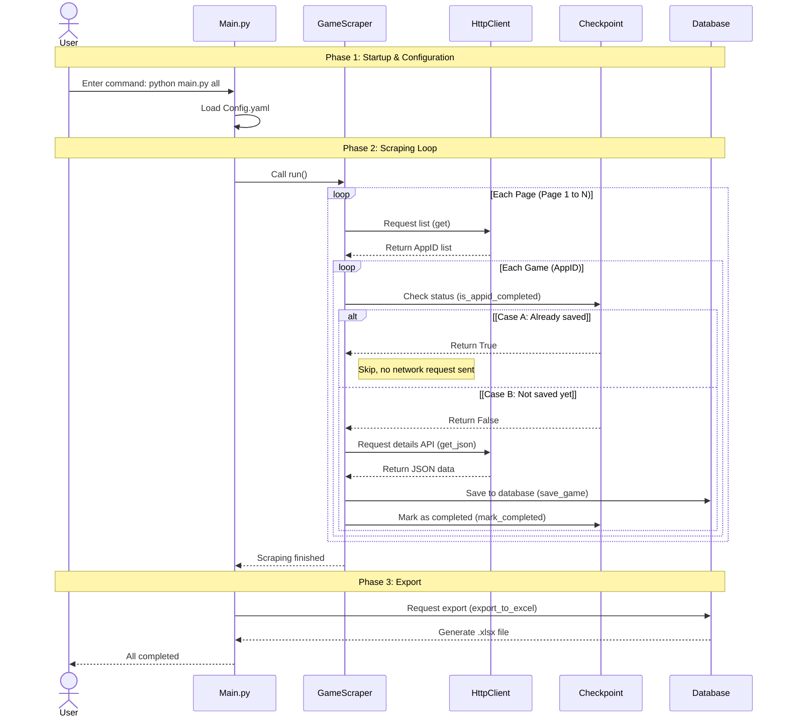

<div align="center">
  <p align="center">
    
  </p>

  <h1>Simple Steam Scraper</h1>
  <p>
    <strong>A simple, efficient, and visual Steam review data scraper. Plug and play.</strong>
  </p>
  <p>
    Designed for data analysis and mining. Built on a fully asynchronous architecture, making data scraping as natural as breathing.
  </p>

  <p>
    <a href="LICENSE"></a>
    
    
    
  </p>

  <p>
    <a href="README.md">中文</a> • 
    <a href="README_EN.md">English</a>
    <br>
  </p>
</div>

---

> [!WARNING]
> This documentation is translated from the [Chinese version](README.md) by Gemini and may not be completely accurate.

## ✨ Why Choose This?

- **⚡️ Blazing Fast Collection**
    - Powered by an **AsyncIO** core engine to easily maximize your network bandwidth on a single machine.
    - Intelligent concurrency control + millisecond-level request intervals find the perfect balance between speed and anti-bot measures.

- **📺 Beautiful & Intuitive Terminal UI**
    - Don't understand code? No problem! This program is not just cold lines of code, but features a beautiful and easy-to-understand terminal interface.
    - Integrated with **Rich** to provide clear control instructions, progress bars, and statistical panels. Even **non-tech users** can intuitively operate and monitor the running status.

- **🛡️ Say Goodbye to "Starting Over"**
    - Internet cut off or errored out at 99%? Don't panic.
    - Built-in industrial-grade **checkpoint resuming** mechanism lets you pause and resume anytime. Every single scrapped record is safely saved.

- **🚀 Ready for Analysis**
    - Not just scraping, but for analysis.
    - Data is stored directly into a structured **SQLite** database; supports one-click export to standard **Excel** reports, so you can start analyzing without writing extra code.

- **🔧 Zero-Code Configuration**
    - Concurrency, timeout, retry counts, target currency... all parameters can be adjusted via `config.yaml`.
    - Even users who don't know how to code can customize their own scraper through simple configuration.

---

## 🛠️ Quick Start

### 1. Install Dependencies

Ensure your Python version is >= 3.8.

```bash
git clone https://github.com/SeraphinaGlacia/steam-scraper.git
cd steam-scraper
pip install -r requirements.txt
```

### 2. Experience the Splash Screen (Easter Egg 🎪) 

We hid this command in the CLI help, though it serves no practical purpose, you can run it to test your environment and inspect the splash screen:

```bash
python main.py start
```

### 3. Standard Workflow

The most commonly used all-in-one command:

```bash
# 1. Start the complete scraping task (Games -> Reviews -> Export Excel + CSV)
python main.py all

# 2. If interrupted, resume progress
python main.py all --resume
```

---

## 📖 Detailed Command Guide

Our CLI follows UNIX philosophy, providing rich subcommands:

### 🎮 Scrape Game Info (`games`)

Only scrapes basic game data (price, developer, rating, etc.) from the Steam store.

```bash
python main.py games              # Scrape all pages
python main.py games --pages 10   # Scrape only first 10 pages (for testing)
python main.py games --resume     # Resume from last checkpoint
```

### 📝 Scrape Review History (`reviews`)

Scrapes historical review trend data for games already in the database.

```bash
python main.py reviews            # Scrape reviews for all games in DB
python main.py reviews --resume   # Resume from checkpoint
```

### 📤 Export Data (`export`)

Exports content from SQLite database to an Excel file.

```bash
python main.py export
# Output file defaults to data/steam_data.xlsx

# If dataset is huge (exceeding Excel's row limit), export as CSV:
python main.py export --format csv
# Generates steam_games.csv and steam_reviews.csv in data/ directory
```

### 🔄 Retry Failures (`retry`)

The program automatically logs all failed requests. Failures due to network fluctuations can be fixed with one click using this command.

```bash
python main.py retry              # Retry all failed tasks
python main.py retry --type game  # Retry only game info tasks
```

### 🧹 Maintenance (`clean` / `reset`)

Keep the project tidy.

> [!CAUTION]
> The `reset` command will delete ALL data, including database, exported files, failure logs, etc., and is irreversible!

```bash
python main.py clean    # Clean Python cache, checkpoints, and temporary files
python main.py reset    # ⚠️ [DANGER] Delete database and all data, reset to initial state
```

---

## ⚙️ Configuration

All magic is defined in `config.yaml`, which you can customize as you wish:

```yaml
scraper:
  language: english       # Steam store language
  currency: us            # Currency code
  category: "998"         # Category ID (998 is for Games)
  max_workers: 20         # Concurrency (15-20 recommended for AsyncIO, higher may trigger bans)

http:
  timeout: 30             # Request timeout (seconds)
  max_retries: 3          # Max retries
  min_delay: 0.5          # Min request interval (seconds)
  max_delay: 1.5          # Max request interval (seconds)

output:
  data_dir: ./data        # Data output directory
  checkpoint_file: .checkpoint.json  # Checkpoint file
```

---

## 📂 Data Structure

After running, the `data/` directory will verify:

| File | Description |
| :--- | :--- |
| `steam_data.db` | **Core Database** (SQLite). Contains `games` and `reviews` tables, suitable for direct SQL queries. |
| `steam_data.xlsx` | **Final Report**. Contains two sheets, ready for analysis without coding. |
| `steam_*.csv` | **CSV Dataset**. Generated for huge datasets, UTF-8-SIG encoded for Excel compatibility. |
| `failures.json` | **Failure Log**. Records failed IDs, reasons, timestamps, etc. Deleted after successful `retry`. |
| `.checkpoint.json` | **Progress Save**. Records completed/failed ID lists for `--resume`. Contains independent states for games and reviews. |
 
## 📈 Workflow Diagram (Omitting `reviews` section)



---

<div align="center">
  <p>Made with ❤️ by SeraphinaGlacia / Zhou Xinlei</p>
</div>
